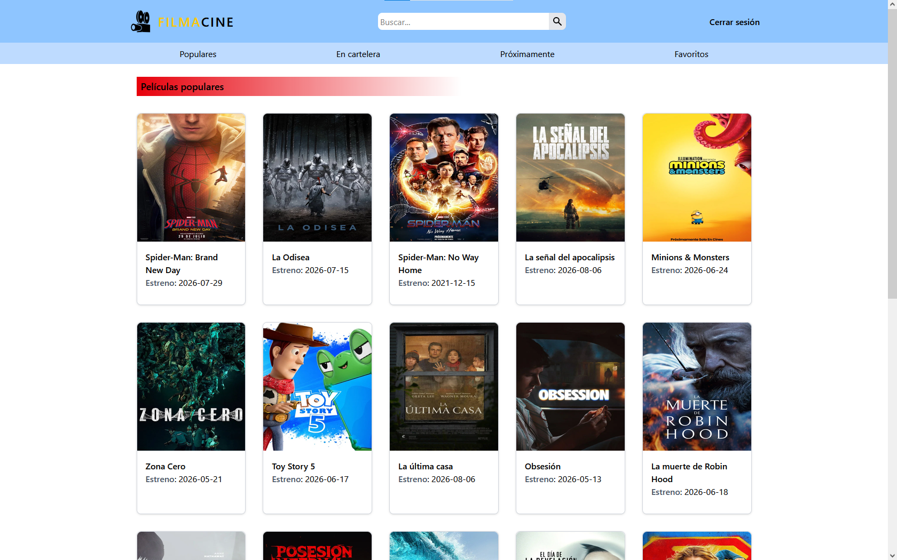
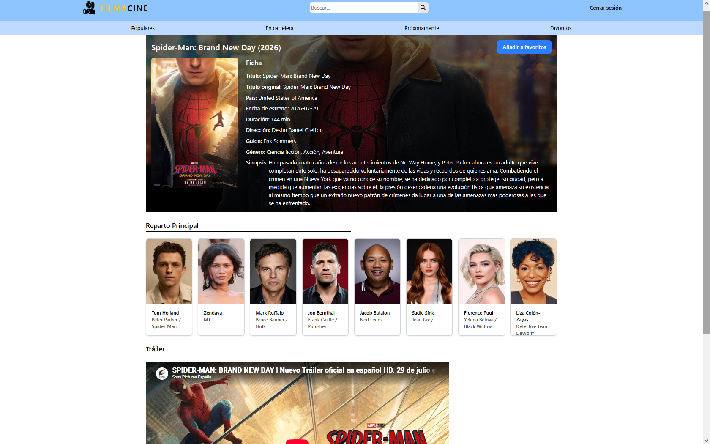
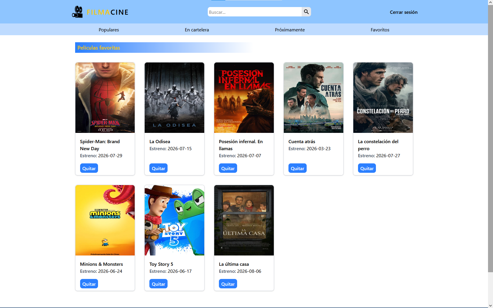

# 🎬 FILMACINE

Aplicación web de películas construida con React y la API de TMDB. Permite explorar películas populares del momento, ver qué está actualmente en cartelera, ver próximos estrenos, buscar títulos, consultar información detallada (reparto, sinopsis, tráiler) y guardar favoritos con persistencia local.

**🔗 Demo en vivo:** [buscador-peliculas-theta.vercel.app](https://buscador-peliculas-theta.vercel.app)

---

## 📸 Capturas

### Página de inicio


### Detalle de película


### Favoritos


---

## ⚙️ Funcionalidades

- 🔐 **Autenticación** de usuario para acceder al contenido de la app
- 🎞️ **Películas populares**, **en cartelera** y **próximos estrenos** (filtradas por región España)
- 🔍 **Buscador** de películas por título, con página de resultados propia
- 📄 **Página de detalle** con sinopsis, reparto y tráiler embebido (con fallback automático a inglés si no hay tráiler en español)
- ⭐ **Favoritos** con persistencia en `localStorage` — se mantienen aunque cierres el navegador
- 📱 **Diseño responsive**, adaptado a móvil, tablet y escritorio

---

## 🛠️ Tecnologías

| Tecnología | Uso |
|---|---|
| **React** | Librería principal para la interfaz |
| **React Router** | Navegación y rutas (incluye `useSearchParams` para el buscador) |
| **Context API** | Gestión de estado global (autenticación y favoritos) |
| **Tailwind CSS** | Estilos y diseño responsive |
| **TMDB API** | Fuente de datos de películas |
| **Vercel** | Despliegue |

---

## 📂 Estructura del proyecto

```
src/
├── components/     # Componentes reutilizables (ListarPeliculas, Navbar, Footer...)
├── pages/          # Páginas / vistas (Inicio, EnCartelera, Proximamente, Buscar, Favoritos, Detalle...)
├── context/         # Context API (AuthContext, FavoritosContext)
├── services/        # Llamadas a la API de TMDB
```

---

## 🚀 Instalación local

1. Clona el repositorio:
```bash
git clone https://github.com/abrahamquiros/buscador-peliculas.git
cd buscador-peliculas
```

2. Instala las dependencias:
```bash
npm install
```

3. Crea un archivo `.env` en la raíz del proyecto con tu API key de TMDB:
```
VITE_API_KEY=tu_api_key_de_tmdb
```
Puedes conseguir una API key gratuita registrándote en [themoviedb.org](https://www.themoviedb.org/documentation/api).

4. Arranca el proyecto:
```bash
npm run dev
```

---

## 🗺️ Próximas mejoras

- [ ] Filtro de películas por género
- [ ] Paginación en los listados

---

## 📄 Créditos

Datos e imágenes proporcionados por [The Movie Database (TMDB)](https://www.themoviedb.org). Este proyecto no está afiliado ni respaldado por TMDB.

Proyecto de demostración con fines de portfolio, sin ánimo de lucro.

---

## 👤 Autor

**Abraham Quirós**
[GitHub](https://github.com/abrahamquiros)
